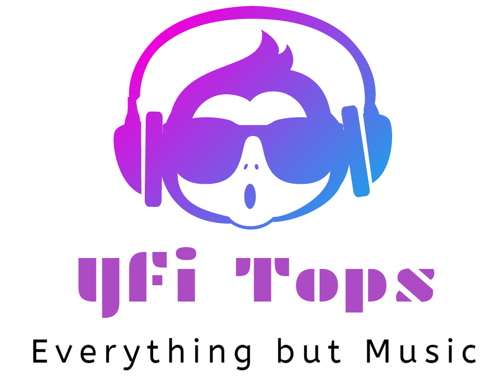
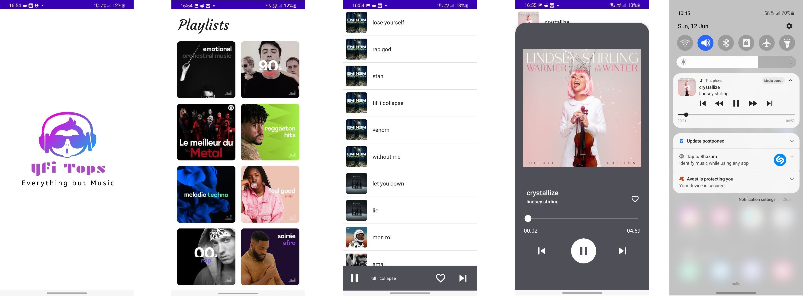
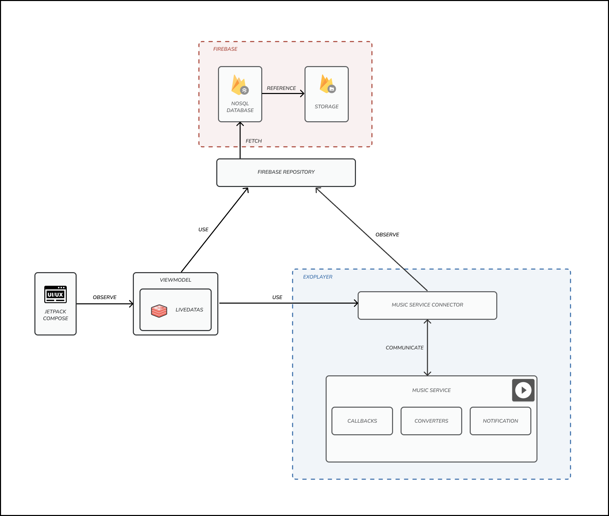
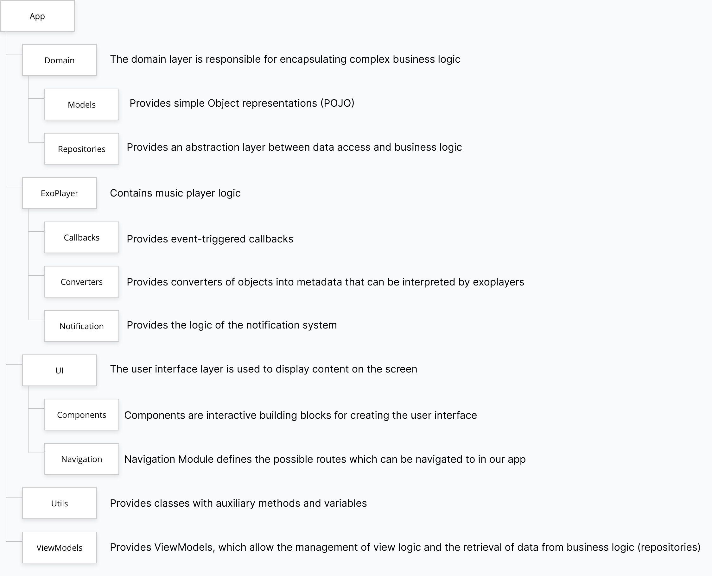
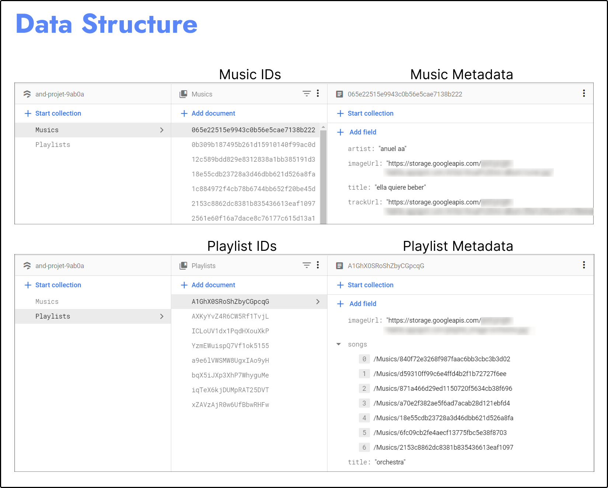

<div align="center">
    

  <h3 align="center">Yfi Tops</h3>

  <p align="center">
    The Yfi Tops Project is a school practical project that aims to extend our skills on android app development and team work. 
    <br />
</div>
<!-- TABLE OF CONTENTS -->
<details>
  <summary>Table of Contents</summary>
  <ol>
    <li>
      <a href="#about-the-project">About The Project</a>
      <ul>
        <li><a href="#built-with">Built With</a></li>
      </ul>
    </li>
    <li>
      <a href="#getting-started">Getting Started</a>
      <ul>
        <li><a href="#prerequisites">Prerequisites</a></li>
        <li><a href="#installation">Installation</a></li>
      </ul>
    </li>
    <li><a href="#architecture">Architecture</a></li>
    <li><a href="#project-structure">Project Structure</a></li>
    <li><a href="#firebase-data-structure">Firebase Data Structure</a></li>
    <li><a href="#license">License</a></li>
    <li><a href="#contact">Contact</a></li>
  </ol>
</details>


<!-- ABOUT THE PROJECT -->

## About The Project

Yfi Tops is a music player application for Android written in [Kotlin](https://kotlinlang.org/).

The music source (playlists and songs) is loaded from a remote server. 
We used [Firestore](https://firebase.google.com/docs/firestore) to store music metadata and 
[Firebase Storage](https://firebase.google.com/docs/storage) to store music tracks.

Users can browse different thematic playlists and songs. Tapping on a song will play it through the use of [ExoPlayer](https://exoplayer.dev/).
The application supports background playback and notification management.

Here is a preview of the Yfi Tops music player app :




### Built With

* [Jetpack Compose](https://developer.android.com/jetpack/compose)
* [ExoPlayer](https://exoplayer.dev)
* [Firestore](https://firebase.google.com/docs/firestore)
* [Firebase Storage](https://firebase.google.com/docs/storage)
* [Glide](https://github.com/bumptech/glide)

<p align="right">(<a href="#top">back to top</a>)</p>


<!-- GETTING STARTED -->

## Getting Started

### Prerequisites

You'll need the following components to use the project, please install them beforehand :

- [Java 11](https://openjdk.java.net/projects/jdk/11/)
- [Android Studio](https://developer.android.com/studio/), with Kotlin plugin and API level 32 installed.

Set up the Firebase media source, respecting the structure shown in section [Firebase Data Structure](#Firebase Data Structure).

### Installation

1. Clone the repo
   ```sh
   git clone https://github.com/Alessandro-AP/Yfi-Tops.git
   ```
2. Install dependencies with gradle.
3. Add the Firebase API config file `google-services.json` into the `./app folder`.
4. Connect your smartphone with Android Studio and run the application.

<p align="right">(<a href="#top">back to top</a>)</p>


<!-- ARCHITECTURE -->

## Architecture

The general architecture of the application is shown below.



Our application consists of four main modules :
- **Jetpack compose** : it constitutes the entire graphical interface of the application, in which the components constituting the interface and the navigation between them are defined.

- **ViewModels** : these take care of updating the graphical interface dynamically when the livedata change. They are also used as an abstraction layer to communicate with the music service connector. In our case, our ViewModels use (wrap) the livedata contained in the firebase repository.

- **ExoPlayer**: This module takes care of the media playback part, allowing our songs to be played, keeping playback in the background and offering a miniplayer in the notification bar. This component in turn is divided into :
  - **Music Service Connector**: this takes care of offering other components/modules of the system all those methods and variables to be able to manage the player.
  - **Music Service**: takes care of initialising and preparing everything necessary for multimedia playback.
  - **Callbacks**: takes care of performing actions based on specific events.
  - **Converters**: take care of converting our templates into a format understandable by the player.
  - **Notification:** takes care of managing the notification system.

- **Firebase**: is used to save our music playlists, in particular **Firebase Storage** is used to save all .mp3 files, album images and individual song images. While **Firebase Datastore**, which is a NoSQL database, contains all the metadata of the playlists/songs, such as the title, author, image and link to the .mp3 file (contained in the Storage).

<!-- PROJECT STRUCTURE-->

## Project Structure

Below is shown the structuring and description of the different folders of the Android project.



<p align="right">(<a href="#top">back to top</a>)</p>

<!-- FIREBASE DATA STRUCTURE-->

## Firebase Data Structure

The image below shows how the data are organised on Firebase.



<p align="right">(<a href="#top">back to top</a>)</p>

<!-- LICENSE -->

## License

Distributed under the MIT License. See `LICENSE` for more information.

<p align="right">(<a href="#top">back to top</a>)</p>


<!-- CONTACT -->

## Contact

[Alessandro Parrino](https://github.com/Alessandro-AP) - alessandro.parrino@heig-vd.ch <br>
[Daniel Sciarra](https://github.com/DS-Daniel) - daniel.sciarra@heig-vd.ch <br>
[Wilfried Karel Ngueukam Djeuda](https://github.com/wilfried01) - wilfriedkarel.ngueukamdjeuda@heig-vd.ch

<p align="right">(<a href="#top">back to top</a>)</p>
